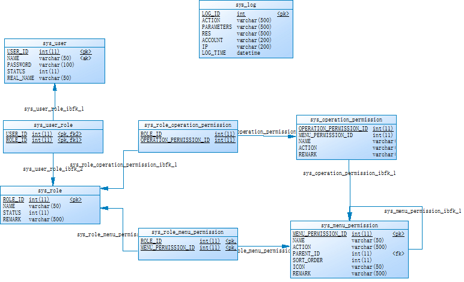

# EasyShiro

---------------

EasyShiro is a security extension components based Shiro. Based on the RBAC (Role Based Access Control) Web permission model based on database rights management and **Web URL authorization**, provides general Shiro security management support, as well as richer and more powerful function options.

Support version: `Shiro 1.2.X`, `Shiro 1.3.X`, `Shiro 1.4.X`


## Introduction

- **Apache Shiro**

  [Apache Shiro](http://shiro.apache.org/ " Apache Shiro ") is the most powerful and comprehensive Java security management framework that provides user authentication, authorization (based on roles and permissions), Session management, encryption, Web and third-party integration, and so on. But Apache Shiro just a security engine, not a rights management system, rights management system daily projects still need to achieve their own, different projects often need to customize a number of different security components, and the configuration is complicated.

- **EasyShiro**

  EasyShiro based Shiro is a security extension components. Based rights management database and **Web URL authorization** RBAC (Role Based Access Control) Web permissions model provides a common Shiro security management support.

- **EasyShiro-Redis-Cache**
  
  An implement of redis cache can be used by shiro, Support Jedis direct connect and Spring-Data-Redis RedisTemplate.https://github.com/ushelp/EasyShiro-Redis-Cache

## EasyShiro Featuter

1. Support RBAC rights management based on database rights management and **Web URL** authorizations

2. Enhanced simplified Shiro unified component support. Provide common **CAPTCHA**, **Automatic login**, **Login lock**, **Error message configuration**, **Interceptor**, **Ajax response**, etc. support

3. Simplifies configuration and simplifies security integration, reducing Shiro's complexity. Just add the `jar` package and adjust some of the configuration( `Shiro.ini`,` spring-shiro.xml`)  options as required to complete the integration and enjoy the complete Shiro stand by

4. **LockLogin** login lock based on `User` and` IP` and provides login lock management system **LockLoginManagement**


## Main module

### 1. Enhanced Simplified Shiro unified component support

- **Auth**: `EasyFormAuthenticationFilter`, full-featured authentication filter, a verification code (CAPTCHA), automatic login (AutoLogin), the login lockout (LockLogin), custom exception message (exceptionMsg), redirect the jump, block , a function of multiple logins, etc.

- **Realm**: `EasyJdbcRealm`, based Realm database to automatically obtain authentication and authorization data from the database, support rights to refresh

- ** Perms **: `EasyURLPermissionFilter`, Authorization Manager filters, Web-based management URL requesting authorization to support Ajax response

- **Logout**: `EasyLogoutFilter`, the user logs off the filter to provide automatic login-related write-offs

- **Interceptor**: Certification and Realm interceptors support ( `EasyAuthenticationInterceptor`,` EasyJdbcRealmInterceptor`), support to expand when the authentication success or failure

- **EasyUsernamePasswordEndcodeToken**: Simplified and more flexible password encryption scheme Token, implement `encodePassword ()`, returns the result of the encrypted password

- **Exception**: custom login authentication related exception ( `EasyIncorrectCaptchaException`,` EasyLockIPException`, `EasyLockUserException`,` EasyLockLoginException`)


### 2. LockLoginManagement

 


## RBCA Model

The following display and provides a common database authorization based rights management, menus, Web URL authorization RBAC (Role Based Access Control) Web permissions model.

 


## Steps for usage

1. Add `jar` dependency

2. Configure the Filter in `web.xml`

3. Use `Spring` or `INI` configure the `Shiro`

### 1. Add jar dependency

```XML
<dependency>
    <groupId>cn.easyproject</groupId>
    <artifactId>easyshiro</artifactId>
    <version>2.6.0-RELEASE</version>
</dependency>
<!-- EasyShiro default dependency shiro version 1.2.6, you can change shiro version, like these: -->
<!--
<dependency>
    <groupId>org.apache.shiro</groupId>
    <artifactId>shiro-core</artifactId>
    <version>${shiro.version}</version>
</dependency>
<dependency>
    <groupId>org.apache.shiro</groupId>
    <artifactId>shiro-web</artifactId>
    <version>${shiro.version}</version>
</dependency>
<dependency>
    <groupId>org.apache.shiro</groupId>
    <artifactId>shiro-ehcache</artifactId>
    <version>${shiro.version}</version>
    <exclusions>
        <exclusion>
            <artifactId>ehcache-core</artifactId>
            <groupId>net.sf.ehcache</groupId>
        </exclusion>
    </exclusions>
</dependency>
<dependency>
    <groupId>org.apache.shiro</groupId>
    <artifactId>shiro-spring</artifactId>
    <version>${shiro.version}</version>
</dependency>
<dependency>
    <groupId>org.apache.shiro</groupId>
    <artifactId>shiro-cas</artifactId>
    <version>${shiro.version}</version>
</dependency>
<dependency>
    <groupId>org.apache.shiro</groupId>
    <artifactId>shiro-quartz</artifactId>
    <version>${shiro.version}</version>
</dependency>
-->
```

### 2. Configure the Filter in `web.xml`

```
<!-- Shiro Spring Intergation -->
<!-- The filter-name matches name of a 'shiroFilter' bean inside applicationContext.xml -->
<filter>
    <filter-name>shiroFilter</filter-name>
    <filter-class>org.springframework.web.filter.DelegatingFilterProxy</filter-class>
    <init-param>
        <param-name>targetFilterLifecycle</param-name>
        <param-value>true</param-value>
    </init-param>
</filter>

<!-- Shiro Web Intergation(shiro.ini, not spring) -->
<!--  
<listener>
    <listener-class>org.apache.shiro.web.env.EnvironmentLoaderListener</listener-class>
</listener>
<filter>
    <filter-name>shiroFilter</filter-name>
    <filter-class>org.apache.shiro.web.servlet.ShiroFilter</filter-class>
</filter> 
--> 
	
<!-- Make sure any request you want accessible to Shiro is filtered. /* catches all -->
<!-- requests. Usually this filter mapping is defined first (before all others) to -->
<!-- ensure that Shiro works in subsequent filters in the filter chain: -->
<filter-mapping>
    <filter-name>shiroFilter</filter-name>
    <url-pattern>/*</url-pattern>
    <dispatcher>REQUEST</dispatcher>
    <dispatcher>FORWARD</dispatcher>
    <dispatcher>INCLUDE</dispatcher>
    <dispatcher>ERROR</dispatcher>
</filter-mapping>
```


### 2. Configuration Templates

#### 2.1 Extended configuration, adjust as needed

- **EasyJdbcRealm**
 -  Configuring the Password column (`passwordColumn`)
 -  Authentication SQL Query(`authenticationQuery`)
 -  Role SQL Query(`userRolesQuery`)
 -  Permissions SQL Query(`permissionsQuery`)
 -  Query support multiple `?` Placeholder (in favor of `union` query).


- **EasyFormAuthenticationFilter**
 - **Extended basic configuration**
 - Successful login into the session's Token name (`sessionTokenKey`)
 - Whether to open the Login redirection(`loginFailureRedirectToLogin`)
 - Extended Token class log in using the fully qualified name (`tokenClassName`)
 - Authentication success or failure of the custom interceptor(`interceptor`), need implements `EasyAuthenticationInterceptor` interface
 -  **CAPTCHA configuration**
 - Whether to open the captcha(`enableCaptcha`)
 - Captchar param name(`captchaParam`)
 - Session codes stored in name (`sessionCaptchaKey`)
 -  **AutoLogin configuration**
 - Whether to open the Auto Login(`enableAutoLogin`)
 - Auto login param name(`autoLoginParam`)
 - Auto login Cookie maxage(`autoLoginMaxAge`)
 - Auto login Cookie path(`autoLoginPath`)
 - Auto login Cookie domain(`autoLoginDomain`)
 - **LockLogin configuration**
 - Whether to open the Lock Login(`enableLockLogin`)
 - LockLogin Shiro EhCache Manager(`ehCacheManager`)
 - Lock check EhCache name(`lockCheckCacheName`)
 - Lock Login EhCache name(`lockLoginCacheName`)
 - Username locking reached the maximum number of login errors(`userLock`)
 - IP locking reached the maximum number of login errors(`ipLock`)
 - Based on the specified number of incorrect login IP, and display codes(`showCaptcha`)
 - **Logon failure related error messages**
 - Name request message or session storage(`msgKey`)
 - Whether the message is stored session(`sessionMsg`)
 - Whether the message is stored request(`requestMsg`)
 - Exception Message Map (`exceptionMsg`), format: `ExceptionSimpleClassName=Message`


- **EasyURLPermissionFilter**
 -  Login timeout detection is turned on(`authenticationTimeoutCheck`)
 -  Authorization failed, Ajax message key(`msg`)
 -  Authorization failed, Ajax status code key(`statusCode`)
 -  Whether the message is stored session(`sessionMsg`)
 -  Whether the message is stored request(`requestMsg`)
 -  Authorization failed prompt content(`permissionDeniedMsg`)
 -  Tip the contents of the login timeout(`authenticationTimeoutMsg`)


#### 2.2 Spring Configuration Templates spring-shiro.xml
```XML
<?xml version="1.0" encoding="UTF-8"?>
<beans xmlns="http://www.springframework.org/schema/beans"
	xmlns:xsi="http://www.w3.org/2001/XMLSchema-instance"
	xmlns:p="http://www.springframework.org/schema/p"
	xsi:schemaLocation="http://www.springframework.org/schema/beans http://www.springframework.org/schema/beans/spring-beans.xsd">
	

    <!-- SessionValidationScheduler (DEFAULT) -->
    <bean id="sessionValidationScheduler" class="org.apache.shiro.session.mgt.ExecutorServiceSessionValidationScheduler">
        <!-- Default is 3,600,000 millis = 1 hour -->
        <property name="interval" value="3600000"></property>
    </bean>
    
    <!-- Session DAO (DEFAULT) -->
    <bean id="sessionDAO" class="org.apache.shiro.session.mgt.eis.EnterpriseCacheSessionDAO">
        <!-- This name matches a cache name in ehcache.xml -->
        <!-- <property name="activeSessionsCacheName" value="shiro-activeSessionsCache"></property> -->
    </bean>
    
    <!-- Session Manager (DEFAULT) -->
    <bean id="sessionManager" class="org.apache.shiro.web.session.mgt.DefaultWebSessionManager">
        <!-- Session Timeout: 3,600,000 milliseconds = 1 hour-->
        <property name="globalSessionTimeout" value="3600000"></property> 
        <property name="sessionValidationScheduler" ref="sessionValidationScheduler"></property>
        <property name="sessionValidationSchedulerEnabled" value="true"></property>
        <property name="sessionDAO" ref="sessionDAO"></property>
    </bean>
    
    <!-- Cache: EhCache (DEFAULT)-->
    <bean id="ehCacheManager" class="org.springframework.cache.ehcache.EhCacheManagerFactoryBean">
        <property name="configLocation" value="classpath:/ehcache.xml" />
        <property name="shared" value="true" />
    </bean>
    <!-- 
    <bean id="cacheManager" class="org.springframework.cache.ehcache.EhCacheCacheManager">
        <property name="cacheManager" ref="ehCacheManager" />
    </bean> 
	   -->
    <bean id="shiroCacheManager" class="org.apache.shiro.cache.ehcache.EhCacheManager">
        <property name="cacheManager" ref="ehCacheManager" />
    </bean>
    
    <!-- RememberMeManager (DEFAULT) -->
    <bean id="cookie" class="org.apache.shiro.web.servlet.SimpleCookie">
        <!-- cookie name  -->
        <property name="name" value="rememberMe"></property>
        <!--  default is /request.getContextPath() -->
        <property name="path" value="/"></property> 
        <!-- default is ONE_YEAR -->
        <property name="maxAge" value="31536000"></property> 
    </bean>
    <bean id="rememberMeManager" class="org.apache.shiro.web.mgt.CookieRememberMeManager">
        <property name="cookie" ref="cookie"></property>
    </bean>

	
    <!--  EasyJdbcRealm (**USER DEFINED**) -->
    <bean id="jdbcRealm" class="cn.easyproject.easyshiro.EasyJdbcRealm">
        <property name="dataSource" ref="dataSource"></property>
        <!-- Authentication information query; default: select * from users where username = ? -->
        <!-- status: 1 on; 2 lock; 3 delete -->
        <property name="authenticationQuery" value="select user_id as userid,name,password,status,real_name as realname from sys_user where name=? and status in(0,1)"></property>
        <!-- Password columns Column name;  default: password -->
        <property name="passwordColumn" value="password"></property>
        <!-- Roles query (supports multiple username =?); default: select role_name from user_roles where username = ?  -->
        <property name="userRolesQuery" value="select name from sys_role where role_id in (select role_id from sys_user_role where user_id=(select user_id from sys_user where name=?)) and status=0"></property>
        <!-- Whether to execute permissions Query permission to query; default: true -->
        <property name="permissionsLookupEnabled" value="true"></property>
        <!-- Permissions query (supports multiple username =?); default: select permission from user_roles_permissions where username = ?"  -->
        <property name="permissionsQuery" value="select action from sys_menu_permission where MENU_PERMISSION_ID in( select MENU_PERMISSION_ID from sys_role_menu_permission where ROLE_ID in(select role_id from sys_user_role where user_id=(select user_id from sys_user where name=?))) UNION select action from sys_operation_permission where OPERATION_PERMISSION_ID in(select OPERATION_PERMISSION_ID from sys_role_operation_permission where ROLE_ID in(select role_id from sys_user_role where user_id=(select user_id from sys_user where name=?)))"></property>
        <!-- EasyJdbcRealm Interceptor, after authentication and authorization information can be obtained, for SimpleAuthenticationInfo authentication and authorization information SimpleAuthorizationInfo additional processing -->
        <!-- 
     		<property name="interceptor" ref="realmInterceptor"></property> 
     		-->
    </bean>
	
    <!-- EasyShiro Custom authentication process interceptors(**USER DEFINED**) -->
    <!-- EasyFormAuthenticationFilter 认证成功或失败拦截器 -->
    <bean id="authenticationInterceptor" class="cn.easyproject.easyee.ssh.sys.shiro.AuthenticationInterceptor"> </bean>
    <!-- EasyJdbcRealm Authentication and authorization information processing interceptor -->
    <bean id="realmInterceptor" class="cn.easyproject.easyee.ssh.sys.shiro.RealmInterceptor"> </bean>

    <!-- auth Login Authentication (**USER DEFINED**) -->
    <bean id="auth" class="cn.easyproject.easyshiro.EasyFormAuthenticationFilter">
    
         <!-- ************ FormAuthenticationFilter Configuration ************ -->
         <!-- when request method is post execute login, else to login page view -->
         <property name="loginUrl" value="/toLogin.action"></property>
         <!-- redirect after successful login -->
         <property name="successUrl" value="/toMain.action"></property>
         <!-- name of request parameter with username; if not present filter assumes 'username' -->
         <property name="usernameParam" value="name"></property>
         <!-- name of request parameter with password; if not present filter assumes 'password' -->
         <property name="passwordParam" value="password"></property>
         <!-- does the user wish to be remembered?; if not present filter assumes 'rememberMe' -->
         <!-- <property name="rememberMeParam" value="rememberMe"></property> -->
         
         
         <!-- ************ EasyFormAuthenticationFilter Configuration ************ -->
         <!-- ## Login Configuration ## -->
         <!-- Login is successful, the token is stored in the session key;default is 'TOKEN' -->
         <property name="sessionTokenKey" value="TOKEN"></property>
         <!-- Whether to use the login fails to redirect the way to jump back to the login page;default is 'false' -->
         <property name="loginFailureRedirectToLogin" value="true"></property>
         
         
         <!-- ************ User defined UsernamePasswordToken Configuration ************ -->
         <!-- customize UsernamePasswordToken; Default is 'org.apache.shiro.auth.UsernamePasswordToken' -->
         <property name="tokenClassName" value="cn.easyproject.easyee.ssh.sys.shiro.UsernamePasswordEncodeToken"></property>
         
         
         <!-- ************ CAPTCHA Configuration ************ -->
         <!-- Are open CAPTCHA verification; default 'true' -->
         <property name="enableCaptcha" value="true"></property>
         <!-- CAPTCHA parameter name; default 'captcha' -->
         <property name="captchaParam" value="captcha"></property>
         <!--key Session codes stored value; default 'captcha' -->
         <property name="sessionCaptchaKey" value="rand"></property>
         
         
         <!-- ************ AutoLogin Configuration ************ -->
         <!-- Are open Auto Login -->
         <property name="enableAutoLogin" value="false"></property>
         <!-- Auto Login parameter name -->
         <property name="autoLoginParam" value="autoLogin"></property>
         <!-- Cookie maxAge ，default is ONE_YEAR -->
         <property name="autoLoginMaxAge" value="31536000"></property>
         <!-- Cookie path，default is "" -->
         <property name="autoLoginPath" value="/"></property>
         <!-- Cookie domain，empty or default is your current domain name -->
         <property name="autoLoginDomain" value=""></property>
         
         
         <!-- ************ LockLogin Configuration ************ -->
         <!-- ## ehcache.xml Configuration ## -->
         <!-- Lock Login management lockout time period EHCache cache name, simply adjust timeToIdleSeconds-->
         <!-- Reach the login lockout times, login lockout 2 Hours -->
         <!-- 
     		 <cache
                    name="shiro-lockLoginCache"
                    maxElementsInMemory="100000"
                    eternal="false"
                    timeToIdleSeconds="0"
                    timeToLiveSeconds="7200"
                    diskExpiryThreadIntervalSeconds="600"
                    memoryStoreEvictionPolicy="LRU"
                    overflowToDisk="true"
                    diskPersistent="true" >
             </cache>
     		-->
        <!--Lock Login login error statistics of the number of time periods EHCache cache name, simply adjust timeToIdleSeconds-->
        <!-- Count the number of errors in 10 minutes  -->
        <!-- 
      		<cache
                   name="shiro-lockCheckCache"
                   maxElementsInMemory="100000"
                   eternal="false"
                   timeToIdleSeconds="0"
                   timeToLiveSeconds="600"
                   diskExpiryThreadIntervalSeconds="600"
                   memoryStoreEvictionPolicy="LRU">
      			<persistence strategy="localTempSwap"/>
              </cache> 
      		--> 
         <!--Whether to open the LockLogin ; default is false, do not open -->
         <property name="enableLockLogin" value="false"></property>
         <!-- Shiro CacheManager -->
         <property name="ehCacheManager" ref="shiroCacheManager"></property>
         <!-- LockLogin Management locked EHCache name cache time period; default shiro-lockLoginCache -->
         <property name="lockLoginCacheName" value="shiro-lockLoginCache"></property>
         <!-- LockLogin Statistics Log error count time period EHCache cache name; defaults to shiro-lockCheckCache -->
         <property name="lockCheckCacheName" value="shiro-lockCheckCache"></property>
         <!--To achieve the same user name to log the number of login errors, login lockout; 0 for no limit; default is 6 -->
         <property name="userLock" value="4"></property>
         <!-- Login achieve the same IP number of errors, login lockout; 0 for no limit; default is 15 -->
         <property name="ipLock" value="6"></property>
         <!-- The specified number of login errors, display codes; -1 does not control verification code display; the default is 1 -->
         <property name="showCaptcha" value="4"></property>
         
		 
         <!-- ************ Logon failure related error messages ************ -->
         <!-- Login failed message key  -->
         <property name="msgKey" value="MSG"></property>
         <!-- The message is stored session，session.setAttribute(MsgKey,xxxErrorMsg); default is 'false' -->
         <property name="sessionMsg" value="true"></property>
         <!-- The message is stored request，request.setAttribute(MsgKey,xxxErrorMsg); default is 'false' -->
         <property name="requestMsg" value="true"></property>
         <!-- # Login error, an exception in content Map-->
         <property name="exceptionMsg">
             <map>
                 <!-- ExceptionClassName:"Message", ExceptionClassName2:"Message2", ... -->
                 <entry key="LockedAccountException" value="Account lockout, please contact the administrator to unlock."></entry>
                 
                 <entry key="AuthenticationException" value="Username or password is incorrect!"></entry>
                 
                 <entry key="EasyIncorrectCaptchaException" value="CAPTCHA is incorrect!"></entry>
                 <entry key="EasyLockUserException" value="User temporarily locking two hours, please try again later."></entry>
                 <entry key="EasyLockIPException" value="IP temporarily locking two hours, please try again later."></entry>
             </map>
         </property>
     	
     	<!-- ************ Customize interceptor, implements EasyAuthenticationInterceptor interface************ -->
     	<property name="interceptor" ref="authenticationInterceptor"></property>
    </bean>
    
    <!-- Specify LogoutFilter  (**USER DEFINED**) -->
    <!-- Enables session security information (Subject / Session), RememberMe information and AutoLogin automatic login logoff information -->
    <bean id="logout" class="cn.easyproject.easyshiro.EasyLogoutFilter">
    	<!-- specify logout redirectUrl -->
    	<property name="redirectUrl" value="/toLogin.action"></property>
    	<!-- EasyFormAuthenticationFilter -->
    	<property name="easyFormAuthenticationFilter" ref="auth"></property>
    </bean>
    
    <!-- perms  (**USER DEFINED**) -->
    <bean id="perms" class="cn.easyproject.easyshiro.EasyURLPermissionFilter">
    	<!-- Authentication failed steering url -->
    	<property name="unauthorizedUrl" value="/toLogin.action"></property>
    	<!-- Login timeout detection is turned on; default is 'true'-->
    	<property name="authenticationTimeoutCheck" value="true"></property>
    	<!-- Authentication failed message key; default is 'MSG'  -->
    	<property name="msgKey" value="msg"></property>
    	<!-- Authentication failed status code key: 301, login timeout; 401 Permission Denied; default is 'statusCode'  -->
    	<property name="statusCode" value="statusCode"></property>
    	<!-- The message is stored session，session.setAttribute(MsgKey,xxxErrorMsg); default is 'false' -->
    	<property name="sessionMsg" value="true"></property>
    	<!-- The message is stored request，request.setAttribute(MsgKey,xxxErrorMsg); default is 'false' -->
    	<property name="requestMsg" value="true"></property>
    	<!-- Authentication failed Tips content;  default is 'Permission denied!' -->
    	<property name="permissionDeniedMsg" value="You do not have permission!"></property>
    	<!-- Login timeout prompt content; default is 'Your login has expired, please login again!' -->
    	<property name="authenticationTimeoutMsg" value="Your login has expired, please login again!"></property>
    </bean>
    
    <!-- Shiro Native SessionManager  (DEFAULT) -->
    <bean id="securityManager" class="org.apache.shiro.web.mgt.DefaultWebSecurityManager">
    	<!-- <property name="sessionMode" value="native"></property> -->
    	<property name="sessionManager" ref="sessionManager"></property>
    	<!-- Cache: EhCache-->
    	<property name="cacheManager" ref="shiroCacheManager"></property>
    	<property name="rememberMeManager" ref="rememberMeManager"></property>
    	<property name="realms">
    		<list>
    			<ref bean="jdbcRealm"/>
    		</list>
    	</property>
    </bean>
    
    <!-- shiroFilter (**USER DEFINED**) -->
    <bean id="shiroFilter" class="org.apache.shiro.spring.web.ShiroFilterFactoryBean">
        <property name="securityManager" ref="securityManager"/>
        <!-- override these for application-specific URLs if you like:-->
        <property name="loginUrl" value="/toLogin.action"/>
        <property name="successUrl" value="/toMain.action"/>
        <property name="unauthorizedUrl" value="/toLogin.action"/> 
        <property name="filterChainDefinitions">
            <value>
                # anonymous
    			/checkCaptcha.action = anon
    			/notFound.action = anon
    			
                # requests to /DoLogout will be handled by the ‘logout’ filter
    			/logout.action = logout
    			
    			# requests to /toLogin.action will be handled by the ‘auth’ filter
    			/toLogin.action = auth
    			
    			# doc page need auth
    			/doc/** = auth
    			
    			# need to permission
    			/toMain.action = auth
    			/*.action =  perms
            </value>
        </property>
    </bean>
    
    <!-- DEFAULT -->
    <bean id="lifecycleBeanPostProcessor" class="org.apache.shiro.spring.LifecycleBeanPostProcessor"/>
</beans>
```


#### 3.2 Shiro INI Configuration Templates shiro.ini
```properties
# -----------------------------------------------------------------------------
# Users and their (optional) assigned roles
# username = password, role1, role2, ..., roleN
# -----------------------------------------------------------------------------
[users]
#admin = admin123, admin
#jay = 123, user
#guest = guest, guest

# -----------------------------------------------------------------------------
# Roles with assigned permissions
# roleName = perm1, perm2, ..., permN
# -----------------------------------------------------------------------------
[roles]
#admin = *
#user = log:*


# -----------------------------------------------------------------------------
# Configuration SessionManager, Cache, Filter
# myFilter = com.company.web.some.FilterImplementation
# myFilter.property1 = value1
# -----------------------------------------------------------------------------

[main]
#- Session Manager (DEFAULT)
# securityManager.sessionManager.xxxx=xxxx

#-- Shiro Native SessionManager (DEFAULT)
sessionManager = org.apache.shiro.web.session.mgt.DefaultWebSessionManager
# Use the configured native session manager:
securityManager.sessionManager = $sessionManager

#-- Session Timeout (DEFAULT)
# 3,600,000 milliseconds = 1 hour
securityManager.sessionManager.globalSessionTimeout = 3600000

#-- Session Listeners
# implement the SessionListener interface (or extend the convenience SessionListenerAdapter) 
# As the default SessionManager sessionListeners property is a collection, you can configure the SessionManager with one or more of your listener implementations like any other collection in shiro.ini:
#aSessionListener = com.foo.my.SessionListener
#anotherSessionListener = com.foo.my.OtherSessionListener
#securityManager.sessionManager.sessionListeners = $aSessionListener, $anotherSessionListener, etc.


#-- Custom Session IDs
# The default SessionIdGenerator is a JavaUuidSessionIdGenerator, 
# which generates String IDs based on Java UUIDs. 
#sessionIdGenerator = com.my.session.SessionIdGenerator
#securityManager.sessionManager.sessionDAO.sessionIdGenerator = $sessionIdGenerator


#-- SessionValidationScheduler (DEFAULT)
# Sessions are only validated to see 
# if they have been stopped or expired at the time they are accessed, 
# A SessionValidationScheduler is responsible for validating sessions 
# at a periodic rate to ensure they are cleaned up as necessary.
# You can custom SessionValidationScheduler implementation class.
sessionValidationScheduler = org.apache.shiro.session.mgt.ExecutorServiceSessionValidationScheduler
# Default is 3,600,000 millis = 1 hour:
sessionValidationScheduler.interval = 3600000
securityManager.sessionManager.sessionValidationScheduler = $sessionValidationScheduler
#securityManager.sessionManager.sessionValidationSchedulerEnabled = false


#-- Session DAO (DEFAULT)
# cache in the CacheManager should be used to store active sessions:
sessionDAO = org.apache.shiro.session.mgt.eis.EnterpriseCacheSessionDAO
securityManager.sessionManager.sessionDAO = $sessionDAO
# By default, the EnterpriseCacheSessionDAO asks the CacheManager 
# for a Cache named "shiro-activeSessionCache"
#sessionDAO.activeSessionsCacheName = ehcache_region_name


#- Cache
# securityManager.cacheManager

#-- EhCache (DEFAULT)
cacheManager = org.apache.shiro.cache.ehcache.EhCacheManager
cacheManager.cacheManagerConfigFile = classpath:ehcache.xml
##-- in-memory-only Cache
#cacheManager = org.apache.shiro.cache.MemoryConstrainedCacheManager
securityManager.cacheManager = $cacheManager

#- RememeberMe(org.apache.shiro.web.mgt.CookieRememberMeManager) (DEFAULT)
securityManager.rememberMeManager.cookie.name = rememberMe
# default is /request.getContextPath()
securityManager.rememberMeManager.cookie.path = /
# default is ONE_YEAR
securityManager.rememberMeManager.cookie.maxAge = 31536000


#------------------------------ When use Session Clustering: Ehcache + Terracotta
#sessionDAO = org.apache.shiro.session.mgt.eis.EnterpriseCacheSessionDAO
## This name matches a cache name in ehcache.xml:
#sessionDAO.activeSessionsCacheName = shiro-activeSessionsCache
#securityManager.sessionManager.sessionDAO = $sessionDAO
#
## Configure The EhCacheManager:
#cacheManager = org.apache.shiro.cache.ehcache.EhCacheManager
#cacheManager.cacheManagerConfigFile = classpath:ehcache.xml
#
## Configure the above CacheManager on Shiro's SecurityManager
## to use it for all of Shiro's caching needs:
#securityManager.cacheManager = $cacheManager
#------------------------------ When use Session Clustering: Ehcache + Terracotta

#- Realm

#-- DataSource (**USER DEFINED**) 
dataSource=com.alibaba.druid.pool.DruidDataSource  
dataSource.url=jdbc:mysql://127.0.0.1:3306/easyssh
dataSource.username=root  
dataSource.password=root  
dataSource.initialSize=1
dataSource.minIdle=1 
dataSource.maxActive=20
dataSource.maxWait=60000
dataSource.timeBetweenEvictionRunsMillis=60000
dataSource.minEvictableIdleTimeMillis=300000
dataSource.validationQuery=SELECT 'x'
dataSource.testWhileIdle=true
dataSource.testOnBorrow=false
dataSource.testOnReturn=false
dataSource.poolPreparedStatements=false
dataSource.maxPoolPreparedStatementPerConnectionSize=20

#-- EasyJdbcRealm (**USER DEFINED**) 
#jdbcRealm=org.apache.shiro.realm.jdbc.JdbcRealm
jdbcRealm=cn.easyproject.easyshiro.EasyJdbcRealm
jdbcRealm.dataSource=$dataSource  
# Authentication information query; default: select * from users where username = ?
jdbcRealm.authenticationQuery=select user_id as userid,name,password,status,real_name as realname from sys_user where name=? and status in(0,1)
# Password columns Column name;  default: password
jdbcRealm.passwordColumn=password
# Roles query (supports multiple username =?); default: select role_name from user_roles where username = ? 
jdbcRealm.userRolesQuery=select name from sys_role where role_id in (select role_id from sys_user_role where user_id=(select user_id from sys_user where name=?)) and status=0 
# Whether to execute permissions Query permission to query; default: true
jdbcRealm.permissionsLookupEnabled=true
# Permissions query (supports multiple username =?); default: select permission from roles_permissions where role_name = ?" 
jdbcRealm.permissionsQuery=select action from sys_menu_permission where MENU_PERMISSION_ID in( select MENU_PERMISSION_ID from sys_role_menu_permission where ROLE_ID in(select role_id from sys_user_role where user_id=(select user_id from sys_user where name=?))) UNION select action from sys_operation_permission where OPERATION_PERMISSION_ID in(select OPERATION_PERMISSION_ID from sys_role_operation_permission where ROLE_ID in(select role_id from sys_user_role where user_id=(select user_id from sys_user where name=?)))  
# EasyJdbcRealm Interceptor, after authentication and authorization information can be obtained, for SimpleAuthenticationInfo authentication and authorization information SimpleAuthorizationInfo additional processing
jdbcRealm.interceptor=$realmInterceptor
# customize EasyJdbcRealm Interceptor, after authentication and authorization information can be obtained, for SimpleAuthenticationInfo authentication and authorization information SimpleAuthorizationInfo additional processing
realmInterceptor=cn.easyproject.easyee.ssh.sys.shiro.RealmInterceptor
jdbcRealm.interceptor=$realmInterceptor

securityManager.realms=$jdbcRealm 


#- auth Login Authentication (**USER DEFINED**) 

#-- customize auth
#auth=cn.easyproject.easyshiro.EasyFormAuthenticationFilter
auth=cn.easyproject.easyshiro.EasyFormAuthenticationFilter
# specify login form page
# when request method is post execute login, else to login page view
auth.loginUrl = /toLogin.action
# redirect after successful login
auth.successUrl = /toMain.action
# name of request parameter with username; if not present filter assumes 'username'
auth.usernameParam = name
# name of request parameter with password; if not present filter assumes 'password'
auth.passwordParam = password
# does the user wish to be remembered?; if not present filter assumes 'rememberMe'
auth.rememberMeParam = rememberMe

#-- EasyFormAuthenticationFilter customize Extended Attributes  (**USER DEFINED**) 
#---- Login Configuration
#Login is successful, the token is stored in the session key;default is 'TOKEN'
# session.setAttribute(sessionTokenName,tokenObject); 
auth.sessionTokenKey= TOKEN
# Whether to use the login fails to redirect the way to jump back to the login page;default is 'false'
auth.loginFailureRedirectToLogin = true

#---- User defined UsernamePasswordToken Configuration (**USER DEFINED**) 
# customize UsernamePasswordToken; Default is 'org.apache.shiro.auth.UsernamePasswordToken'
auth.tokenClassName=cn.easyproject.easyee.ssh.sys.shiro.UsernamePasswordEncodeToken

#---- CAPTCHA Configuration (**USER DEFINED**) 
# Whether to open the CAPTCHA; default 'true'
auth.enableCaptcha=true
# CAPTCHA parameter name default 'captcha'
auth.captchaParam = captcha
# CAPTCHA nanme in Session; default 'captcha'
auth.sessionCaptchaKey = rand


#---------  AutoLogin Configuration  (**USER DEFINED**) 
# Are open Auto Login 
auth.enableAutoLogin=false
# Auto Login parameter name 
auth.autoLoginParam=autoLogin
# Cookie maxAge ，default is ONE_YEAR 
auth.autoLoginMaxAge=31536000
# Cookie path，default is "" 
auth.autoLoginPath=/
# Cookie domain，empty or default is your current domain name 
#auth.autoLoginDomain=

#---- LockLogin Configuration Logon failure related error messages (**USER DEFINED**) 
# Are oepn LockLogin; default is false,off
auth.enableLockLogin=false
# Shiro CacheManager 
auth.ehCacheManager=$cacheManager
# LockLogin Management locked EHCache name cache time period; default shiro-lockLoginCache
auth.lockLoginCacheName=shiro-lockLoginCache
# LockLogin Statistics Log error count time period EHCache cache name; defaults to shiro-lockCheckCache 
auth.lockCheckCacheName=shiro-lockCheckCache
#To achieve the same user name to log the number of login errors, login lockout; 0 for no limit; default is 6 
auth.userLock=4
#  Login achieve the same IP number of errors, login lockout; 0 for no limit; default is 15 
auth.ipLock=6
# The specified number of login errors, display codes; -1 does not control verification code display; the default is 1 
auth.showCaptcha=2

#---- Logon failure related error messages (**USER DEFINED**) 
# Login failed message key 
auth.msgKey = MSG
# The message is stored session，session.setAttribute(MsgKey,xxxErrorMsg); default is 'false'
auth.sessionMsg = true
# The message is stored request，request.setAttribute(MsgKey,xxxErrorMsg); default is 'false'
auth.requestMsg = true
# Login error, an exception in content  Map
# ExceptionClassName:"Message", ExceptionClassName2:"Message2", ...
auth.exceptionMsg = LockedAccountException:"Account lockout, please contact the administrator to unlock.", AuthenticationException:"User name or password is incorrect!", EasyIncorrectCaptchaException:"CAPTCHA is incorrect!", EasyLockUserException:"User temporarily locking two hours, please try again later.", EasyLockIPException:"IP temporarily locking two hours, please try again later."

#---- customize EasyJdbcRealmInterceptor  interceptor, You can customize the code after the authentication process succeeds or fails (**USER DEFINED**) 
authenticationInterceptor=cn.easyproject.easyee.ssh.sys.shiro.AuthenticationInterceptor
auth.interceptor=$authenticationInterceptor


#- user Authentication (**USER DEFINED**) 
# user filter, if not remeberMe redirected to the url, default is '/login.jsp'
user.loginUrl=/login.jsp

#- Logout (**USER DEFINED**) 
# specify LogoutFilter
# logout = org.apache.shiro.web.filter.authc.LogoutFilter
# specify logout redirectUrl
logout=cn.easyproject.easyshiro.EasyLogoutFilter
logout.redirectUrl = /login.jsp
# EasyFormAuthenticationFilter
logout.easyFormAuthenticationFilter=$auth

#- perms  (**USER DEFINED**) 
## Authorization filter rules based on URL
perms=cn.easyproject.easyshiro.EasyURLPermissionFilter
# Authentication failed steering url
perms.unauthorizedUrl=/login.jsp
# Login timeout detection is turned on; default is 'true'
perms.authenticationTimeoutCheck= true

## Authorization failed related error messages (**USER DEFINED**) 
# Authentication failed message key; default is 'msg' 
perms.msgKey = msg
# Authentication failed status code key: 301, login timeout; 401 Permission Denied; default is 'statusCode' 
perms.statusCode = statusCode
# The message is stored session，session.setAttribute(MsgKey,xxxErrorMsg); default is 'false'
perms.sessionMsg = true
# The message is stored request，request.setAttribute(MsgKey,xxxErrorMsg); default is 'false'
perms.requestMsg = true
# Authentication failed Tips content;  default is 'Permission denied!'
perms.permissionDeniedMsg = You do not have permission!
# Login timeout prompt content; default is 'Your login has expired, please login again!'
perms.authenticationTimeoutMsg = Your login has expired, please login again!


# -----------------------------------------------------------------------------
# Urls and their filter
# URL_Ant_Path_Expression = Path_Specific_Filter_Chain
# filter1[optional_config1], filter2[optional_config2], ..., filterN[optional_configN]
# -----------------------------------------------------------------------------
[urls] (**USER DEFINED**) 
 # anonymous
/checkCaptcha.action = anon
/notFound.action = anon

# requests to /DoLogout will be handled by the ‘logout’ filter
/logout.action = logout

# requests to /toLogin.action will be handled by the ‘auth’ filter
/toLogin.action = auth

# doc page need auth
/doc/** = auth

# need to permission
/toMain.action = auth
/*.action =  perms
```


## Detailed functional components

#### 1. EasyFormAuthenticationFilter：Fully functional form login authentication filter extends the `FormAuthenticationFilter`。

  - Token successful login into the Session
 
  - Redirect Jump Support (after successful login or avoid failure caused by repeated submission to refresh invalid login request)
 
  - Sign exception messages configuration support (for different custom exception error message, and save the error messages to request and session (redirect) Scope)
 
  - CAPTCHA codes support
 
  - AutoLogin automatic login support
 
  - LockLogin login lockout support
 
 - `EasyAuthenticationInterceptor` Authentication success and failure interceptors support (for example, after a successful user authentication lock detection, or query initialization menu extension work.)
 
 - Logged-in users to re-login account (Shiro default browser has logged the case, landing new accounts will automatically jump to the original login page)
 
 - Inherited RememberMe support (using the built-in user filter implementation, Shiro default RememberMe not used to automatically log on, but for the user filters)


#### 2. EasyLogoutFilter: The user logout filter extends the `LogoutFilter`.

- Enables session security information (Subject / Session), RememberMe information and AutoLogin automatic login logoff information.


####  3. EasyUsernamePasswordEndcodeToken: Simplified and more flexible password encryption scheme Token, extends the `UsernamePasswordToken`.

- Results simplifies password encrypted login, simply inherit `EasyUsernamePasswordEndcodeToken`, self-fulfilling` encodePassword () `password encryption logic to return the encrypted password

- Can add custom properties when using `EasyJdbcRealm` login authentication, auto-login queries with the same name attribute statements related user database column value assigned to the class (` encodePassword() `can be used to encrypt the database column encryption attributes as` salt`)


#### 4. EasyJdbcRealm: General database authentication, roles, permissions inquiry Realm, extends the `AuthorizingRealm`。

- When `doGetAuthenticationInfo` user login authentication, users can query statement to query the information in the database, all automatically initialized to login authentication Token` UsernamePasswordToken` extension of the same name attribute subclass solve the authentication information does not contain a database of user attributes problem

- Provides a static `reloadPermissions` method ** can refresh permissions after successful authentication ** (example: re-assign user permissions, user permissions to refresh the current date.)

- `EasyJdbcRealmInterceptor` authentication and authorization information interceptors (re-deposited after example, after obtaining authorization or authentication information, for secondary processing, such as permission for a particular character string segmentation segmentation` StringPermissions` and so on.)

- Compatible with `UsernamePasswordToken` and` EasyUsernamePasswordEndcodeToken` login authentication

- Provide EasyJdbcRealm, extended JdbcRealm, solve the problem of authentication information database does not contain user attributes.
Able to login authentication, user information in the database, all automatically packaged into a user login authentication Token (EasyUsernamePasswordToken) in.

#### 5. EasyURLPermissionFilter: Based on the URL authorization rule matches judge Perms, extends the `PermissionsAuthorizationFilter`.

- If the URL string permissions string ( `String Permissions`), the access is allowed, otherwise not allowed
- Support Login Timeout detection

- Support **Ajax response**, use Ajax requests to insufficient permissions or login timeout JSON output (messages can be custom configured by `permissionDeniedMsg`, `authenticationTimeoutMsg`):
```JSON
{ "MSG":"You do not have permission!","statusCode":"401" }
{ "MSG":"Your login has expired, please login again!","statusCode":"301" }
```


#### 6. Login authentication related custom exception

- `EasyIncorrectCaptchaException`, Verification code error exceptions, extends `AuthenticationException`

- `EasyLockLoginException`, Login lockout exception parent class, extends `AuthenticationException`

- `EasyLockIPException`, IP lock exception, extends  `EasyLockLoginException`

- `EasyLockUserException`, User lock exception, extends  `EasyLockLoginException`


#### 7. Interceptor support

- `EasyAuthenticationInterceptor`, User authentication or identification blocker (for example, after a user authentication lock detection, or query initialization menu extension work.)

- `EasyJdbcRealmInterceptor`, Authentication and authorization information interceptors(For example, after obtaining authorization or authentication information, for secondary processing, such as permission for a particular string of characters will be split after split again into the `StringPermissions` like.)


## EasyShiro Redis Cache

[EasyShiro-Redis-Cache](https://github.com/ushelp/EasyShiro-Redis-Cache) is an implement of redis cache can be used by shiro, Support Jedis direct connect and Spring-Data-Redis RedisTemplate.


### Maven

```XML
<dependency>
	<groupId>cn.easyproject</groupId>
	<artifactId>easyshiro-redis-cache</artifactId>
	<version>2.6.0-RELEASE</version>
</dependency>
```

### Configure
Configure RedisManager(Jedis) or RedisTemplate redis connect.

```XML
	<!-- RedisTemplate Start -->
	<!-- JedisPool -->
	<bean id="jedisPoolConfig" class="redis.clients.jedis.JedisPoolConfig">
		<property name="maxTotal" value="${redis.pool.maxTotal}"></property>
		<property name="maxIdle" value="${redis.pool.maxIdle}"></property>
		<property name="maxWaitMillis" value="${redis.pool.maxWaitMillis}"></property>
		<property name="testOnBorrow" value="${redis.pool.testOnBorrow}"></property>
		<property name="testOnReturn" value="${redis.pool.testOnReturn}"></property>
	</bean>
	
	<bean id="jedisConnFactory"
		class="org.springframework.data.redis.connection.jedis.JedisConnectionFactory"
		p:use-pool="true">
		<property name="hostName" value="${redis.host}"></property>
		<property name="port" value="${redis.port}"></property>
		<property name="database" value="${redis.database}"></property>
		<!-- <property name="password" value="pwd456"></property> -->
		<property name="poolConfig" ref="jedisPoolConfig"></property>
	</bean>
	
	<!-- Redis template definition -->
	<bean id="redisTemplate" class="org.springframework.data.redis.core.RedisTemplate"
		p:connection-factory-ref="jedisConnFactory">
		
		<!-- !IMPORTANT: key is must 'StringRedisSerializer' -->
		<property name="keySerializer">
			<bean class="org.springframework.data.redis.serializer.StringRedisSerializer"></bean>
		</property>
		<property name="hashKeySerializer">
			<bean class="org.springframework.data.redis.serializer.StringRedisSerializer"></bean>
		</property>
		<property name="valueSerializer">
			<bean class="org.springframework.data.redis.serializer.JdkSerializationRedisSerializer"></bean>
		</property>
		<property name="hashValueSerializer">
			<bean class="org.springframework.data.redis.serializer.JdkSerializationRedisSerializer"></bean>
		</property>
	</bean>
	<!-- RedisTemplate End-->
	

	<!-- shiro redisManager -->
<!-- 	<bean id="redisManager" class="cn.easyproject.shirorediscache.RedisManager">
		<property name="host" value="127.0.0.1"/>
		<property name="port" value="6379"/>
		optional properties:
		<property name="timeout" value="10000"/>
		<property name="password" value="123456"/>
	</bean> -->
	
	
	<!-- Session DAO (Redis)-->
	<bean id="sessionDAO" class="cn.easyproject.shirorediscache.RedisSessionDAO">
		<!--  0 - never expire -->
		<property name="expire" value="1800"/>
		<property name="redisTemplate" ref="redisTemplate"></property>
	<!-- 	<property name="redisManager" ref="redisManager"></property> -->
	</bean>
	
	<!-- Cache: Redis (securityManager) -->
	<bean id="shiroCacheManagerRedis" class="cn.easyproject.shirorediscache.RedisCacheManager">
		<property name="redisTemplate" ref="redisTemplate"></property>
<!-- 		<property name="redisManager" ref="redisManager"></property> -->
	</bean>
	
	<!-- SecurityManager -->
	<bean id="securityManager" class="org.apache.shiro.web.mgt.DefaultWebSecurityManager">
		<!-- <property name="sessionMode" value="native"></property> -->
		<property name="sessionManager" ref="sessionManager"></property>
		<!-- Cache: Redis-->
		<property name="cacheManager" ref="shiroCacheManagerRedis"></property>
		<property name="rememberMeManager" ref="rememberMeManager"></property>
		<property name="realms">
			<list>
				<ref bean="jdbcRealm"/>
			</list>
		</property>
	</bean>
	
	<!-- ... -->
````


## Other features configuration

- ### Rights to refresh
`EasyJdbcRealm` It provides a static `reloadPermissions` method can refresh permission after successful authentication (for example: re-assign user permissions, user permissions to refresh the current date.)

- ### Log message prompts management
 EasyFormAuthenticationFilter In accordance with the appropriate configuration exception error message, and depending on the configuration into the request or session to save.

 #### 1. Error Message Custom Configuration
 ```XML
 <!-- ## Logon failure related error messages ## -->
 <!-- Login failed message key  -->
 <property name="msgKey" value="MSG"></property>
 <!-- The message is stored session，session.setAttribute(MsgKey,xxxErrorMsg); default is 'false' -->
 <property name="sessionMsg" value="true"></property>
 <!-- The message is stored request，request.setAttribute(MsgKey,xxxErrorMsg); default is 'false' -->
 <property name="requestMsg" value="true"></property>
 <!-- # Login error, an exception in the content Map-->
 <property name="exceptionMsg">
     <map>
         <!-- ExceptionClassName:"Message", ExceptionClassName2:"Message2", ... -->
         <entry key="LockedAccountException" value="Account lockout, please contact the administrator to unlock."></entry>
         
         <entry key="AuthenticationException" value="Username or password is incorrect!"></entry>
         
         <entry key="EasyIncorrectCaptchaException" value="Code is incorrect!"></entry>
         <entry key="EasyLockUserException" value="user temporarily locking two hours, please try again later."></entry>
         <entry key="EasyLockIPException" value="IP temporarily locking two hours, please try again later."></entry>
     </map>
 </property>
 ```
 ```
 #---- Error Message Custom Configuration
 # Login failed message key
 auth.msgKey = MSG
 # The message is stored session，session.setAttribute(MsgKey,xxxErrorMsg); default is 'false'
 auth.sessionMsg = true
 # The message is stored request，request.setAttribute(MsgKey,xxxErrorMsg); default is 'false'
 auth.requestMsg = true
 # Login error, an exception in the content Map
 # ExceptionClassName:"Message", ExceptionClassName2:"Message2", ...
 auth.exceptionMsg = LockedAccountException:"Account lockout, please contact the administrator to unlock.", AuthenticationException:"Username or password is incorrect!", EasyIncorrectCaptchaException:"Code is incorrect!", EasyLockUserException:"user temporarily locking two hours, please try again later.", EasyLockIPException:"IP temporarily locking two hours, please try again later."
 ```
 
 #### 2. Page message reminding examples
 ```
 <!-- Log message prompts JS -->
 <s:if test="#session.MSG!=null">
 	<script type="text/javascript">
 		$(function() {
 			uiEx.alert("${MSG }", "info");
 		})
 	</script>
 	<s:set name="MSG" scope="session" value=""></s:set>
 </s:if>
 ```


## LockLogin 

`EasyFormAuthenticationFilter` providing lock-based `EhCache` of Lock Login login.

### 1. ehcache.xml Configuration
Use Lock Login, you must configure the login lockout-related EhCache cache configuration `shiro-lockLoginCache`，`shiro-lockCheckCache`。

  ```XML
  <!-- ## LockLogin Configuration ## -->
  <!-- LockLogin name cache management locks EHCache time period-->
  <!-- Simply adjust timeToIdleSeconds, the default number of times to reach the login lockout, login lockout 2 Hours-->
  <cache
     	    name="shiro-lockLoginCache"
          maxElementsInMemory="100000"
          eternal="false"
          timeToIdleSeconds="0"
          timeToLiveSeconds="7200"
          diskExpiryThreadIntervalSeconds="600"
          memoryStoreEvictionPolicy="LRU"
          overflowToDisk="true"
          diskPersistent="true">
  </cache>
    
   <!-- EHCache caching name Lock Login login error statistics of the number of time periods -->
   <!-- Simply adjust timeToIdleSeconds, default statistics the number of errors in 10 minutes -->
   <cache
   	    name="shiro-lockCheckCache"
        maxElementsInMemory="100000"
        eternal="false"
        timeToIdleSeconds="0"
        timeToLiveSeconds="600"
        diskExpiryThreadIntervalSeconds="600"
        memoryStoreEvictionPolicy="LRU"
        overflowToDisk="true"
        diskPersistent="true">
	</cache>
  ```

### 2. LockLogin Controller

- Lock control based on the user name (User) of
- IP-based lock control
- IP-based control codes is displayed
 
 ```XML
 <!--Whether to open the LockLogin ; default is false, do not open -->
 <property name="enableLockLogin" value="false"></property>
 <!-- Shiro CacheManager -->
 <property name="ehCacheManager" ref="shiroCacheManager"></property>
 <!-- LockLogin Management locked EHCache name cache time period; default shiro-lockLoginCache -->
 <property name="lockLoginCacheName" value="shiro-lockLoginCache"></property>
 <!-- LockLogin Statistics Log error count time period EHCache cache name; defaults to shiro-lockCheckCache -->
 <property name="lockCheckCacheName" value="shiro-lockCheckCache"></property>
 <!--To achieve the same user name to log the number of login errors, login lockout; 0 for no limit; default is 6 -->
 <property name="userLock" value="4"></property>
 <!-- Login achieve the same IP number of errors, login lockout; 0 for no limit; default is 15 -->
 <property name="ipLock" value="6"></property>
 <!-- The specified number of login errors, display codes; -1 does not control verification code display; the default is 1 -->
 <property name="showCaptcha" value="4"></property>
 ```
 ```
 #---- LockLogin Configuration Logon failure related error messages
 # Are oepn LockLogin; default is false,off
 auth.enableLockLogin=false
 # Shiro CacheManager 
 auth.ehCacheManager=$cacheManager
 # LockLogin Management locked EHCache name cache time period; default shiro-lockLoginCache
 auth.lockLoginCacheName=shiro-lockLoginCache
 # LockLogin Statistics Log error count time period EHCache cache name; defaults to shiro-lockCheckCache 
 auth.lockCheckCacheName=shiro-lockCheckCache
 #To achieve the same user name to log the number of login errors, login lockout; 0 for no limit; default is 6 
 auth.userLock=4
 #  Login achieve the same IP number of errors, login lockout; 0 for no limit; default is 15 
 auth.ipLock=6
 # The specified number of login errors, display codes; -1 does not control verification code display; the default is 1 
 auth.showCaptcha=2
 ```

### 3. Lock determination

EasyShiro of `EasyFormAuthenticationFilter` filter jump to the login page has examined whether to display a verification code or IP is locked, and the information is stored in` Session`. Analyzing information can be obtained from the `Session` in page.

- IP is locked `session.IPLock`
```
<s:if test="#session.IPLock!=null">
	<span style="color:#ff0000; font-weight:bold">您的 IP 地址由于连续登录错误过多，已被锁定 2 小时，请稍后再试。</span>
</s:if>
```

- Whether you need to display a verification code `session.ShowCAPTCHA`
```
<s:if test="#session.ShowCAPTCHA!=null"> 
     <tr>
          <td>Verification:</td>
          <td>
                <input class="easyui-validatebox textbox"
                id="captcha" name="captcha"   
                style="height:30px;width: 80px;" data-options="required:true, validType:'minLength[4]' , tipPosition:'right',position:'bottom', deltaX:105"
                maxlength="4"></input> 
                <div style="display: none; float: right; border: 1px solid #ccc;" id="vcTr">
                     
                </div>
          </td>
     </tr>   
</s:if>  
```

### 4. LockLogin Management
- The `locklogin` into the web root directory, you can visit:
```
http://127.0.0.1:8088/easyee-ssh/locklogin/admin.jsp
```
- The default cache code below, you can be modified as needed
```
String lockLogin="shiro-lockLoginCache";
String lockLCheck="shiro-lockCheckCache";
```
- `locklogin/admin.jsp` Note that there is no access control

 
 
 
 
 
 
 
 
 


## END
### [The official home page](http://www.easyproject.cn/easyshiro/en/index.jsp 'The official home page')

[Comments](http://www.easyproject.cn/easyshiro/en/index.jsp#donation 'Comments')

If you have more comments, suggestions or ideas, please contact me.


### [官方主页](http://www.easyproject.cn/easyshiro/zh-cn/index.jsp '官方主页')

[留言评论](http://www.easyproject.cn/easyshiro/zh-cn/index.jsp#donation '留言评论')

如果您有更好意见，建议或想法，请联系我。


Email：<inthinkcolor@gmail.com>

[http://www.easyproject.cn](http://www.easyproject.cn "EasyProject Home")


We believe that the contribution of each bit by bit, will be driven to produce more and better free and open source products a big step.

**Thank you donation to support the server running and encourage more community members.**

[](https://www.paypal.me/easyproject/10 "Make payments with PayPal - it's fast, free and secure!")
