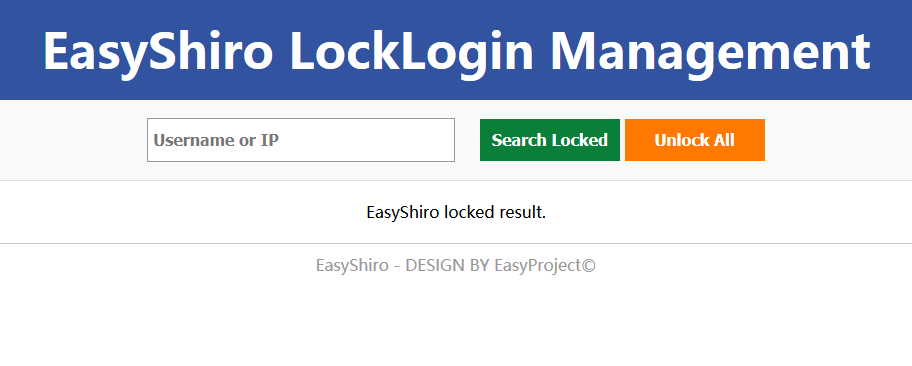
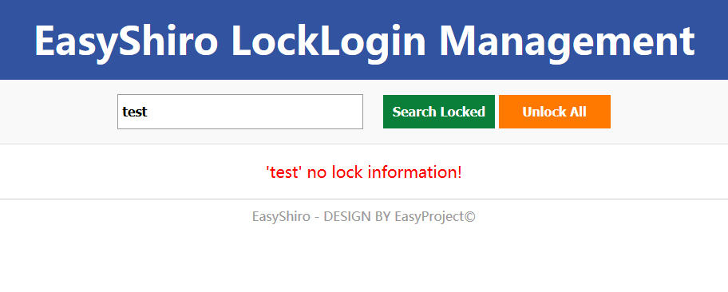
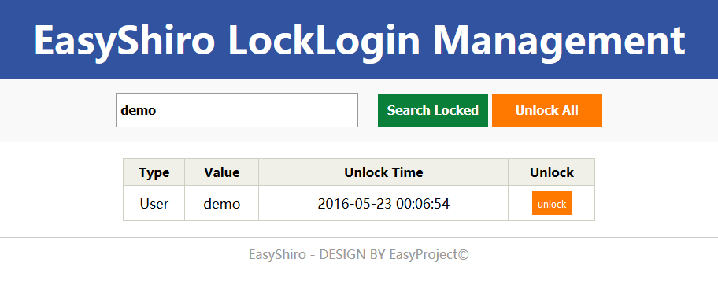
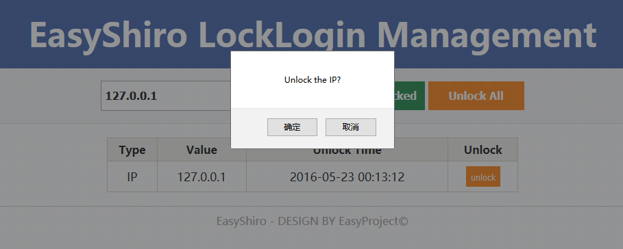

# EasyShiro 

---------------

EasyShiro 是一个基于 Shiro 的安全扩展组件。为基于数据库权限管理和 **Web URL 授权** 的 RBAC（Role Based Access Control） Web 权限模型，提供通用的 Shiro 安全管理支持，以及更加丰富强大的功能选项。


EasyShiro is a security extension components based Shiro. Based on the RBAC (Role Based Access Control) Web permission model based on database rights management and **Web URL authorization**, provides general Shiro security management support, as well as richer and more powerful function options.

## Latest Version

- Least version:  `2.3.0-RELEASE`


## Featuter/特点

- **中文**

 1. 支持基于基于数据库权限管理和 **Web URL** 授权的 RBAC 权限管理

 2. 增强简化的 Shiro 统一组件支持。提供通用的 **验证码**，**自动登录**，**登录锁定**，**错误消息配置**，**拦截器**，**Ajax 响应** 等等支持
 
 3. 配置简单，简化安全集成，减少 Shiro 的复杂性。提供了完整的**通用配置模板**(`shiro.ini`, `spring-shiro.xml`)仅需加入 `jar` 包，按需求调整部分配置选项，即可完成集成，享受完整的 Shiro 支持

 4. 基于 `User` 和 `IP` 的 **LockLogin** 登录锁定功能，并提供登录锁定管理系统 **LockLoginManagement**

- **English**

 1. Support RBAC rights management based on database rights management and **Web URL** authorizations
 
 2. Enhanced simplified Shiro unified component support. Provide common **CAPTCHA**, **Automatic login**, **Login lock**, **Error message configuration**, **Interceptor**, **Ajax response**, etc. support
 
 3. Simplifies configuration and simplifies security integration, reducing Shiro's complexity. Just add the `jar` package and adjust some of the configuration( `Shiro.ini`,` spring-shiro.xml`)  options as required to complete the integration and enjoy the complete Shiro stand by
 
 4. **LockLogin** login lock based on `User` and` IP` and provides login lock management system **LockLoginManagement**


## LockLogin Management/登录锁定管理系统

支持基于 `User` 和  `IP` 的锁定控制，及基于 IP 的`验证码是否显示`控制。

Supports lock control based on `User` and `IP`, and IP-based `whether CAPTCHA display `control.











## Maven

```XML
<dependency>
    <groupId>cn.easyproject</groupId>
    <artifactId>easyshiro</artifactId>
    <version>2.3.0-RELEASE</version>
</dependency>
```


## Document/文档

### 中文

[中文说明文档](doc/readme-zh-CN.md)

[官方主页](http://www.easyproject.cn/easyshiro/zh-cn/index.jsp '官方主页')

[留言评论](http://www.easyproject.cn/easyshiro/zh-cn/index.jsp#donation '留言评论')

如果您有更好意见，建议或想法，请联系我。

### English

[English Readme](doc/readme-en.md)

[The official home page](http://www.easyproject.cn/easyshiro/en/index.jsp 'The official home page')

[Comments](http://www.easyproject.cn/easyshiro/en/index.jsp#donation 'Comments')

If you have more comments, suggestions or ideas, please contact me.

## End

Email：<inthinkcolor@gmail.com>

[http://www.easyproject.cn](http://www.easyproject.cn "EasyProject Home")


**支付宝钱包扫一扫捐助：**

我们相信，每个人的点滴贡献，都将是推动产生更多、更好免费开源产品的一大步。

**感谢慷慨捐助，以支持服务器运行和鼓励更多社区成员。**

</img>


We believe that the contribution of each bit by bit, will be driven to produce more and better free and open source products a big step.

**Thank you donation to support the server running and encourage more community members.**

[](https://www.paypal.me/easyproject/10 "Make payments with PayPal - it's fast, free and secure!")

